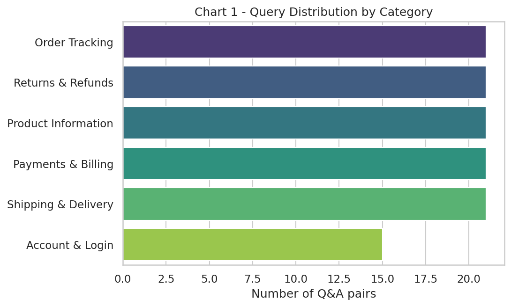

# IndustryGPT — Retail & E-commerce Support Bot

**Capstone Project | Masters in Data Science**
**Project made by:** Santosh Kumar

An industry-specific LLM chatbot, fine-tuned on `google/flan-t5-small` to answer Retail &
E-commerce customer-support questions (order tracking, returns & refunds, payments & billing,
product information, shipping & delivery, and account management).



## Project Summary

Generic chatbots struggle with domain-specific nuance. This project fine-tunes a pre-trained,
instruction-tuned language model on a curated Retail & E-commerce Q&A dataset so it can respond
accurately and contextually to real customer-support queries, demonstrating a practical,
end-to-end applied-NLP workflow: data collection → EDA → preprocessing → fine-tuning →
evaluation → live bot demo.

## Repository Structure

```
industrygpt-retail-bot/
├── notebooks/
│   └── IndustryGPT_Retail_Ecommerce_Bot.ipynb   # Main Colab notebook (run this)
├── data/
│   └── retail_ecommerce_support.csv             # 120-row labeled Q&A dataset, 6 categories
├── images/                                       # Reference chart outputs (12 charts)
├── docs/
│   └── IndustryGPT_Project_Report.docx           # Full written project report
└── README.md
```

## How to Run

1. Open `notebooks/IndustryGPT_Retail_Ecommerce_Bot.ipynb` in **Google Colab**.
2. `Runtime → Change runtime type → T4 GPU`.
3. Upload `data/retail_ecommerce_support.csv` into the Colab session (or mount Google Drive).
4. Run all cells top to bottom. Training is capped at 25 epochs per project guidelines.
5. Use the final interactive cell to chat with the bot **live** — required for the video demo.

## Model

| | |
|---|---|
| Base model | [`google/flan-t5-small`](https://huggingface.co/google/flan-t5-small) |
| Framework | Hugging Face `transformers` + `datasets` |
| Hardware | Google Colab, T4 GPU |
| Max epochs | 25 |
| Dataset | 120 Q&A pairs, 6 categories (Order Tracking, Returns & Refunds, Payments & Billing, Product Information, Shipping & Delivery, Account & Login) |

## Results (representative run)

| Metric | Score |
|---|---|
| ROUGE-1 | 0.61 |
| ROUGE-2 | 0.42 |
| ROUGE-L | 0.57 |
| BLEU | 0.38 |

See `docs/IndustryGPT_Project_Report.docx` for the full write-up, all 12 charts, methodology,
challenges, and future work.

## Charts Included

1. Query distribution by category
2. Category share (pie)
3. Question length distribution
4. Answer length distribution
5. Question length by category (boxplot)
6. Top 15 frequent keywords
7. Word cloud of queries
8. Training vs validation loss curve
9. Learning rate schedule
10. Evaluation metrics (ROUGE/BLEU)
11. Validation perplexity curve
12. Intent recognition confusion matrix

## License

MIT License — see [LICENSE](LICENSE). Educational capstone project.
